<!-- Animated Background & Header Illustration -->
<p align="center">
  
</p>

---

## 👾 About Me

```typescript
const supernovaprime = {
  location:   "Accra, Ghana 🇬🇭",
  role:       "Software Engineer · Velvron Labs",
  focus:      ["Full-Stack Development", "TypeScript", "React/Next.js", "System Architecture"],
  email:      "ebenezerayimful@gmail.com",
  portfolio:  "supernovaprimeportfolio.vercel.app",
  available:  true,
};

🛠 Tech Stack
<p align="left">


</p>
Skills Proficiency (Animated)
<p align="center">

</p>
📊 GitHub Analytics
<p align="center">

</p>
🧱 Projects
Repository	Description
velvron-labs	Company website/portfolio
portfolio	Personal portfolio
Backend	Backend API services
Examination	3D WebGL scene
🤝 Connect
<p align="center">
<a href="https://github.com/supernovaprime"></a>
<a href="https://supernovaprimeportfolio.vercel.app"></a>
<a href="mailto:ebenezerayimful@gmail.com"></a>
</p>
<sub>🚀 Built with <a href="https://github.com/supernovaprime">supernovaprime</a> · Velvron Labs · 2026-06-05</sub>